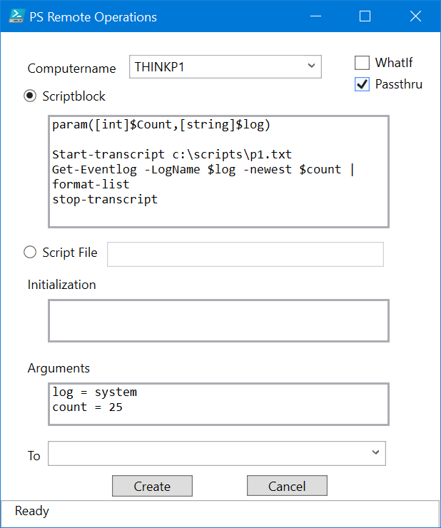

# PSRemoteOperations

[](https://www.powershellgallery.com/packages/PSRemoteOperations/) [](https://www.powershellgallery.com/packages/PSRemoteOperations/)

This PowerShell module is designed to run commands on remote computers but _without_ using PowerShell remoting. It takes advantage of cloud services like Dropbox and OneDrive. The central concept is that you create a file with instructions about a command to run on a remote or target computer. The file includes the target computer name. The remote computer is monitoring a shared folder and when a matching file is detected the operation is invoked. The shared or common folder is managed by the cloud service of your choice.

You can install the latest version from the PowerShell Gallery:

```powershell
Install-Module PSRemoteOperations [-scope currentUser]
```

See [About_PSRemoteOperations](docs/about_PSRemoteOperations.md) for more detail. Pay close attention to the details on defining values for `$PSRemoteOpPath` and `$PSRemoteOpArchive`.

Or check out the individual commands:

+ [Get-PSRemoteOperationResult](docs/Get-PSRemoteOperation.md)
+ [Get-PSRemoteOperationResult](docs/Get-PSRemoteOperationResult.md)
+ [Invoke-PSRemoteOperation](docs/Invoke-PSRemoteOperation.md)
+ [New-PSRemoteOperation](docs/New-PSRemoteOperation.md)
+ [Register-PSRemoteOperationWatcher](docs/Register-PSRemoteOperationWatcher.md)
+ [Wait-PSRemoteOperation](docs/Wait-PSRemoteOperation.md)
+ [New-PSRemoteOperationForm](docs/New-PSRemoteOperationForm.md)
+ [Register-PSRemoteOpPath](docs/Register-PSRemoteOpPath.md)
+ [Import-PSRemoteOpPath](docs/Import-PSRemoteOpPath.md)

## Graphical Interface

The module includes a command called `[New-PSRemoteOperationForm](docs/New-PSRemoteOperationForm.md)`. This is intended to provide an easy way to setup a new remote operation file. You launch the form from the PowerShell prompt.

```powershell
PS C:\> New-PSRemoteOperationForm
```



This should work fine for simple script blocks. For anything more complicated, it is recommended that you use a shared script file.

## Cross-Platform and PowerShell Core

The long-term goal is to ensure that this module will work cross-platform and in PowerShell 7. Basic functionality should exist running this module on PowerShell 7, both in Windows and non-Windows environments. Support for CMS messages is limited to Windows platforms through the use of dynamic parameters. `Register-PSRemoteOperationWatcher` requires a Windows platform but should work under PowerShell 7. For non-Windows systems, you will have to come up with your own tooling for monitoring and execution using `Invoke-PSRemoteOperation`.

Last updated 2019-08-20 13:31:49Z UTC
